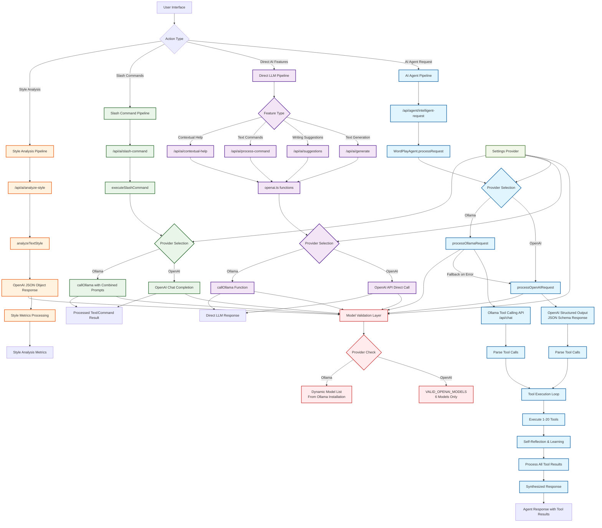

# WordPlay LLM Pipeline Flow

## 🔄 All LLM API Call Pipelines

## 📊 Pipeline Summary

### 1. **AI Agent Pipeline** (Most Complex)
- **Endpoint**: `/api/agent/intelligent-request`
- **Features**: Tool calling, autonomous execution, self-reflection
- **Providers**: OpenAI + Ollama (with fallback)
- **Models**: Your 6 OpenAI models OR user's installed Ollama models
- **Capability**: Can execute 1-20 tools in sequence, learns from results

### 2. **Direct LLM Pipeline** (Simple AI Features)
- **Endpoints**: `/api/ai/generate`, `/api/ai/suggestions`, `/api/ai/process-command`, `/api/ai/contextual-help`
- **Features**: Single-shot LLM calls for specific tasks
- **Providers**: OpenAI + Ollama
- **Use Cases**: Text generation, writing suggestions, basic commands

### 3. **Slash Command Pipeline** (Editor Integration)
- **Endpoint**: `/api/ai/slash-command`
- **Features**: In-editor text processing commands (/improve, /summarize, etc.)
- **Providers**: OpenAI + Ollama
- **Use Cases**: Quick text edits and improvements

### 4. **Style Analysis Pipeline** (OpenAI Only)
- **Endpoint**: `/api/ai/analyze-style`
- **Features**: Deep text analysis with structured metrics
- **Providers**: OpenAI only (requires JSON object response)
- **Use Cases**: Writing quality assessment, style metrics

## 🎯 Key Differences:
- **Agent Pipeline**: Autonomous, multi-step, tool-using
- **Direct Pipeline**: Simple, single-response LLM calls  
- **Slash Pipeline**: Editor-integrated text processing
- **Style Pipeline**: Analytical, metrics-focused

All pipelines respect your model restrictions (6 OpenAI models + dynamic Ollama models). 