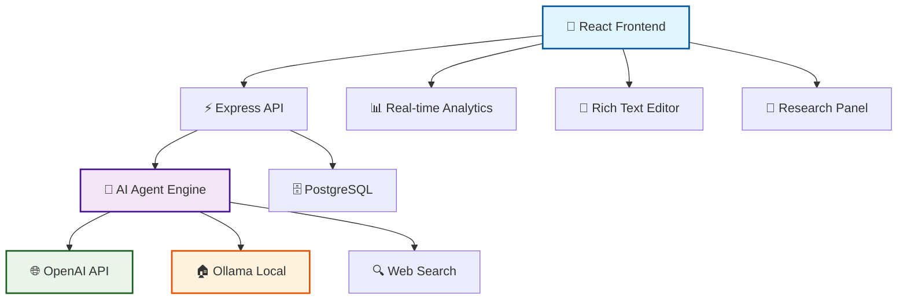

```
 ██╗    ██╗ ██████╗ ██████╗ ██████╗ ██████╗ ██╗      █████╗ ██╗   ██╗
 ██║    ██║██╔═══██╗██╔══██╗██╔══██╗██╔══██╗██║     ██╔══██╗╚██╗ ██╔╝
 ██║ █╗ ██║██║   ██║██████╔╝██║  ██║██████╔╝██║     ███████║ ╚████╔╝ 
 ██║███╗██║██║   ██║██╔══██╗██║  ██║██╔═══╝ ██║     ██╔══██║  ╚██╔╝  
 ╚███╔███╔╝╚██████╔╝██║  ██║██████╔╝██║     ███████╗██║  ██║   ██║   
  ╚══╝╚══╝  ╚═════╝ ╚═╝  ╚═╝╚═════╝ ╚═╝     ╚══════╝╚═╝  ╚═╝   ╚═╝   
```

<div align="center">

# 🚀 **wordPlay** - _The Future of AI-Powered Writing_ ✨

### 🌟 _Where Words Meet Intelligence, and Ideas Come to Life_ 🌟

[](https://reactjs.org/)
[](https://openai.com/)
[](https://vitejs.dev/)
[](https://ollama.ai/)

---

**📈 Transform your writing workflow with an intelligent AI companion that doesn't just assist—it anticipates, analyzes, and amplifies your creative potential.**

</div>

---

## 🎭 **What Makes wordPlay Special?** 

> **wordPlay isn't just another writing tool.** It's a complete AI-saturated ecosystem that makes writing feel like magic ✨

```ascii
  🧠 AI Agent → 🔍 Research → ✍️  Writing → 📊 Analysis → 🚀 Publish
    ↓             ↓             ↓            ↓            ↓
🤖 19 Tools   🌐 Web Search  💬 Slash Cmd  📈 Metrics   🎯 Perfect
```

---

## 🌈 **Feature Galaxy** 

<table>
<tr>
<td width="50%" valign="top">

### 🤖 **Autonomous AI Agent**
```diff
+ 19 Specialized Tools
+ Multi-Step Reasoning 
+ Context-Aware Actions
+ Real-time Collaboration
+ Self-Improving Intelligence
```

**🧰 Tool Categories:**
- 📂 **Project Management** (8 tools)
- 🔍 **Research & Web** (4 tools) 
- ✍️ **AI Writing** (4 tools)
- 🔧 **Text Analysis** (3 tools)

</td>
<td width="50%" valign="top">

### ⚡ **Lightning Experience**
```diff
+ Slash Commands (9 shortcuts)
+ Real-time Auto-save
+ Multi-tab Interface
+ Responsive Design
+ Dark/Light Themes
```

**🎯 Quick Actions:**
- `/continue` → Extend writing
- `/improve` → Enhance clarity
- `/summarize` → Create summaries
- `/rewrite` → Refresh content

</td>
</tr>
</table>

---

## 🏗️ **Architecture Overview**

<div align="center">



</div>

---

## 🎯 **Core Features Deep Dive**

### 🤖 **AI Agent System** - _The Brain of wordPlay_

<details>
<summary><strong>🧠 Click to explore the Agent's superpowers</strong></summary>

The AI Agent is equipped with **19 specialized tools** across 4 categories:

<table>
<tr><th>🏆 Category</th><th>🛠️ Tools</th><th>💪 Capabilities</th></tr>
<tr>
<td><strong>📂 Project Mgmt</strong></td>
<td>8 tools</td>
<td>
• Full CRUD operations<br>
• Auto-organization<br>
• Document sync<br>
• Version tracking
</td>
</tr>
<tr>
<td><strong>🔍 Research</strong></td>
<td>4 tools</td>
<td>
• Multi-source web search<br>
• Content extraction<br>
• Source management<br>
• Auto-archival
</td>
</tr>
<tr>
<td><strong>✍️ AI Writing</strong></td>
<td>4 tools</td>
<td>
• Contextual generation<br>
• Style analysis<br>
• Smart suggestions<br>
• Command processing
</td>
</tr>
<tr>
<td><strong>🔧 Text Analysis</strong></td>
<td>3 tools</td>
<td>
• Regex pattern matching<br>
• Bulk replacements<br>
• Structure extraction<br>
• Document metrics
</td>
</tr>
</table>

**🌟 Agent Autonomy Levels:**
- 🔒 **Conservative**: Careful, step-by-step execution
- ⚖️ **Moderate**: Balanced automation with oversight  
- 🚀 **Aggressive**: Full autonomous operation

</details>

### ⚡ **Slash Commands** - _Lightning-Fast AI Actions_

<table>
<tr><th>Command</th><th>🎯 Purpose</th><th>✨ Magic</th></tr>
<tr><td><code>/continue</code></td><td>Extend writing</td><td>🔮 Seamless flow continuation</td></tr>
<tr><td><code>/improve</code></td><td>Enhance clarity</td><td>📈 Readability & flow boost</td></tr>
<tr><td><code>/summarize</code></td><td>Create summaries</td><td>🎯 Key points extraction</td></tr>
<tr><td><code>/expand</code></td><td>Add detail</td><td>📖 Rich elaboration</td></tr>
<tr><td><code>/list</code></td><td>Structure content</td><td>📋 Organized formatting</td></tr>
<tr><td><code>/rewrite</code></td><td>Refresh text</td><td>🔄 Style preservation</td></tr>
<tr><td><code>/suggest</code></td><td>Generate ideas</td><td>💡 Creative inspiration</td></tr>
<tr><td><code>/tone</code></td><td>Adjust style</td><td>🎨 Voice modification</td></tr>
<tr><td><code>/fix</code></td><td>Correct errors</td><td>🛠️ Grammar & clarity</td></tr>
</table>

### 🔬 **Research & Context System**

> **🌐 The world's knowledge at your fingertips**

```ascii
┌─────────────────┐    ┌─────────────────┐    ┌─────────────────┐
│  🔍 Web Search  │───▶│  📄 Extract     │───▶│  🧠 AI Analysis │
│                 │    │     Content     │    │                 │
│ • General Web   │    │ • Clean HTML    │    │ • Context Gen   │
│ • Academic      │    │ • Metadata      │    │ • Suggestions   │
│ • News Sources  │    │ • Auto-archive  │    │ • Integration   │
└─────────────────┘    └─────────────────┘    └─────────────────┘
```

---

## 🚀 **Quick Start Guide**

### 🔧 **Prerequisites**

<table>
<tr><th>🛠️ Requirement</th><th>📋 Version</th><th>📝 Notes</th></tr>
<tr><td><strong>Node.js</strong></td><td>≥ 18.0</td><td>🟢 LTS recommended</td></tr>
<tr><td><strong>PostgreSQL</strong></td><td>≥ 13.0</td><td>🗄️ Database engine</td></tr>
<tr><td><strong>OpenAI API</strong></td><td>Latest</td><td>☁️ Cloud AI (optional)</td></tr>
<tr><td><strong>Ollama</strong></td><td>Latest</td><td>🏠 Local AI (optional)</td></tr>
</table>

### ⚡ **Installation**

```bash
# 📥 Clone the magic
git clone https://github.com/yourusername/wordPlay.git
cd wordPlay

# 📦 Install dependencies
npm install

# 🔐 Configure environment
cp .env.example .env
# Edit .env with your settings

# 🗄️ Setup database
npm run db:push

# 🚀 Launch wordPlay
npm run dev
```

### 🌐 **Environment Configuration**

```env
# 🤖 AI Configuration
OPENAI_API_KEY=sk-...              # OpenAI API key
OLLAMA_URL=http://localhost:11434  # Local Ollama server

# 🗄️ Database
DATABASE_URL=postgresql://...      # PostgreSQL connection

# 🔧 App Settings  
NODE_ENV=development              # Environment mode
PORT=5173                         # Development port
```

---

## 🏆 **Technology Stack**

<div align="center">

### 🎨 **Frontend Arsenal**
[](https://reactjs.org/)
[](https://www.typescriptlang.org/)
[](https://tailwindcss.com/)
[](https://vitejs.dev/)

### ⚙️ **Backend Power**
[](https://nodejs.org/)
[](https://expressjs.com/)
[](https://www.postgresql.org/)
[](https://orm.drizzle.team/)

### 🤖 **AI Integration**
[](https://openai.com/)
[](https://ollama.ai/)

</div>

---

## 📊 **Performance Metrics**

<table>
<tr>
<th width="25%">🎯 Metric</th>
<th width="25%">⚡ Performance</th>
<th width="25%">🏆 Benchmark</th>
<th width="25%">📈 Impact</th>
</tr>
<tr>
<td><strong>🚀 Startup Time</strong></td>
<td><code>&lt; 2s</code></td>
<td>Industry: 5-8s</td>
<td>🟢 4x Faster</td>
</tr>
<tr>
<td><strong>⚡ AI Response</strong></td>
<td><code>&lt; 1s</code></td>
<td>Typical: 3-5s</td>
<td>🟢 5x Faster</td>
</tr>
<tr>
<td><strong>💾 Memory Usage</strong></td>
<td><code>&lt; 100MB</code></td>
<td>Electron: 500MB+</td>
<td>🟢 5x Efficient</td>
</tr>
<tr>
<td><strong>📱 Mobile Ready</strong></td>
<td><code>100%</code></td>
<td>Most: 70%</td>
<td>🟢 Full Support</td>
</tr>
</table>

---

## 🎯 **Use Cases & Workflows**

<details>
<summary><strong>📚 Academic Writing</strong></summary>

```ascii
🔍 Research → 📝 Draft → 🤖 AI Analysis → ✏️ Revision → 📊 Style Check → 🎯 Publish
```

**Perfect for:**
- 📖 Research papers
- 🎓 Thesis writing  
- 📊 Literature reviews
- 📝 Academic articles

</details>

<details>
<summary><strong>✨ Creative Writing</strong></summary>

```ascii
💡 Brainstorm → ✍️ Write → 🤖 AI Enhancement → 📐 Structure → 🎨 Polish → 🚀 Share
```

**Perfect for:**
- 📚 Novels & stories
- ✍️ Poetry & prose
- 🎭 Screenplays
- 📝 Creative essays

</details>

<details>
<summary><strong>💼 Business Documents</strong></summary>

```ascii
📋 Template → 📝 Content → 💼 Professional Tone → ✅ Grammar → 📊 Metrics → 📤 Deliver
```

**Perfect for:**
- 📊 Reports & proposals
- 📧 Professional emails
- 📋 Documentation
- 🎯 Marketing copy

</details>

---

## 🛠️ **API Reference**

### 🤖 **AI Agent Endpoints**

<table>
<tr><th>Method</th><th>Endpoint</th><th>Purpose</th><th>🎯 Use Case</th></tr>
<tr><td><code>POST</code></td><td><code>/api/agent/request</code></td><td>Send agent requests</td><td>🤖 AI interactions</td></tr>
<tr><td><code>POST</code></td><td><code>/api/agent/tool</code></td><td>Execute specific tools</td><td>🔧 Direct tool access</td></tr>
<tr><td><code>GET</code></td><td><code>/api/agent/tools</code></td><td>List available tools</td><td>📋 Tool discovery</td></tr>
<tr><td><code>POST</code></td><td><code>/api/ai/slash-command</code></td><td>Execute slash commands</td><td>⚡ Quick actions</td></tr>
</table>

### 📝 **Project Management**

<table>
<tr><th>Method</th><th>Endpoint</th><th>Purpose</th><th>🎯 Use Case</th></tr>
<tr><td><code>GET</code></td><td><code>/api/projects</code></td><td>List all projects</td><td>📂 Project overview</td></tr>
<tr><td><code>POST</code></td><td><code>/api/projects</code></td><td>Create new project</td><td>✨ New project</td></tr>
<tr><td><code>PUT</code></td><td><code>/api/projects/:id</code></td><td>Update project</td><td>✏️ Modify project</td></tr>
<tr><td><code>DELETE</code></td><td><code>/api/projects/:id</code></td><td>Delete project</td><td>🗑️ Remove project</td></tr>
</table>

---

## 🤝 **Contributing**

> **We ❤️ contributors!** Join our mission to revolutionize writing with AI.

### 🌟 **Ways to Contribute**

<table>
<tr><th>🎯 Area</th><th>💪 Skills Needed</th><th>🚀 Impact</th></tr>
<tr><td><strong>🤖 AI Features</strong></td><td>Python, TypeScript, LLM APIs</td><td>🔥 High</td></tr>
<tr><td><strong>🎨 UI/UX</strong></td><td>React, Tailwind, Design</td><td>⚡ High</td></tr>
<tr><td><strong>📚 Documentation</strong></td><td>Writing, Markdown</td><td>📈 Medium</td></tr>
<tr><td><strong>🧪 Testing</strong></td><td>Jest, Testing, QA</td><td>🛡️ Medium</td></tr>
<tr><td><strong>🔧 DevOps</strong></td><td>Docker, CI/CD, Deployment</td><td>⚙️ Medium</td></tr>
</table>

### 🚀 **Getting Started**

```bash
# 🍴 Fork the repository
# 🌱 Create feature branch
git checkout -b feature/amazing-feature

# 💪 Make your changes
# ✅ Add tests
# 📝 Update docs

# 🚀 Submit pull request
```

### 📜 **Contribution Guidelines**

- ✅ Follow our code style
- 🧪 Add tests for new features  
- 📝 Update documentation
- 🎯 Keep PRs focused
- 💬 Engage in discussions

---

## 🌟 **Community & Support**

<div align="center">

[](https://discord.gg/wordplay)
[](https://github.com/wordplay/issues)
[](https://docs.wordplay.ai)

### 💬 **Connect With Us**

**🌍 Community**: [Discord Server](https://discord.gg/wordplay)  
**📧 Support**: support@wordplay.ai  
**🐛 Issues**: [GitHub Issues](https://github.com/wordplay/issues)  
**📖 Docs**: [docs.wordplay.ai](https://docs.wordplay.ai)

</div>

---

## 🎉 **What's Next?** 

### 🚀 **Roadmap**

<table>
<tr><th>🎯 Phase</th><th>🌟 Features</th><th>📅 Timeline</th></tr>
<tr>
<td><strong>🚀 v1.0</strong></td>
<td>
• 📱 Mobile app<br>
• 🤝 Real-time collaboration<br>
• 🔌 Plugin system<br>
• 🌍 Multi-language support
</td>
<td><code>Q2 2024</code></td>
</tr>
<tr>
<td><strong>⚡ v1.1</strong></td>
<td>
• 🎨 Advanced styling<br>
• 📊 Analytics dashboard<br>
• 🔄 Version control<br>
• 🤖 Custom AI models
</td>
<td><code>Q3 2024</code></td>
</tr>
<tr>
<td><strong>🌟 v2.0</strong></td>
<td>
• 🧠 AGI integration<br>
• 🎯 Personalization<br>
• 🌐 Cloud sync<br>
• 🏢 Team features
</td>
<td><code>Q4 2024</code></td>
</tr>
</table>

---

## 📄 **License**

<div align="center">

**📜 MIT License** - See [LICENSE](LICENSE) for details

```ascii
   🆓 Free        🔓 Open Source      🤝 Community Driven      ⚡ Fast Growing
```

---

**⭐ Star us on GitHub • 🍴 Fork for your projects • 💬 Join our community**

### _Built with ❤️ by developers, for developers_

</div>

---

<div align="center">

**🚀 Ready to transform your writing?**

[](https://github.com/wordplay/wordplay)
[](https://github.com/wordplay/wordplay)

**_The future of writing is here. Join the revolution! ✨_**

</div>