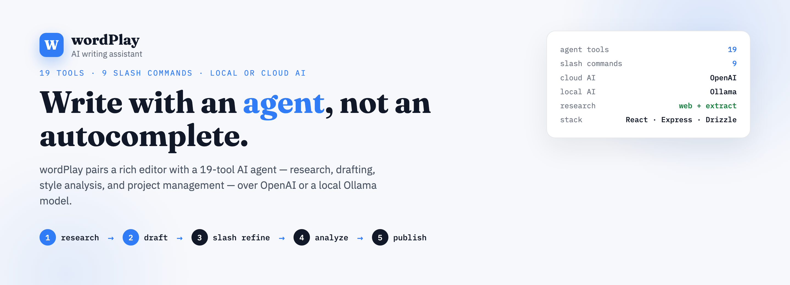
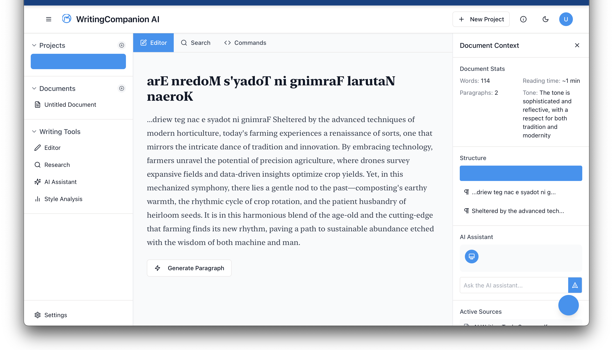

<p align="center">
  
</p>

# WordPlay

An editor with an AI agent beside it — write with a 19-tool agent, not an autocomplete.

WordPlay pairs a rich writing workspace with a 19-tool AI agent — research, drafting, style analysis, and project management — using OpenAI or a local Ollama model. It runs in the browser with a React/Express stack and stores everything in PostgreSQL.



## What it does

- **19-tool AI agent.** Four categories: project management, research & web, AI writing, and text analysis. Autonomy levels from conservative to aggressive.
- **Slash commands.** `/continue`, `/improve`, `/summarize`, `/expand`, `/rewrite`, `/tone`, and more — AI actions without leaving the editor.
- **Research & context.** Web search, content extraction, and source management feed the agent and your drafts.
- **Projects & documents.** Multi-tab interface, real-time auto-save, and full project CRUD with version tracking.
- **Style analysis.** Word counts, reading time, tone, and structure metrics as you write.
- **Cloud or local AI.** OpenAI for hosted models, Ollama for a fully local, no-key setup.
- **Dark/light themes** and a responsive layout.

## Quick start

You need Node.js ≥ 18 and PostgreSQL ≥ 13.

```bash
git clone https://github.com/0-CYBERDYNE-SYSTEMS-0/wordPlay.git
cd wordPlay
npm install
cp .env.example .env   # add your DATABASE_URL, and an OpenAI or Ollama key
npm run db:push
npm run dev            # → http://localhost:5173
```

Without keys, WordPlay uses Ollama at `http://localhost:11434` (or a configurable `OLLAMA_URL`). The app works with cloud OpenAI, local Ollama, or both.

## Architecture

```
React 18 + Vite / TypeScript / Tailwind ─▶ Express API ─┬─ AI Agent Engine
                                                        ├─ PostgreSQL + Drizzle ORM
                                                        ├─ OpenAI API (cloud, optional)
                                                        ├─ Ollama (local, optional)
                                                        └─ Web search / extraction
```

## Docs

| Document | What's in it |
|----------|--------------|
| [`LLM_PIPELINE_FLOW.md`](LLM_PIPELINE_FLOW.md) | How agent requests route through the model pipeline |
| [`AGENT_FIXES_SUMMARY.md`](AGENT_FIXES_SUMMARY.md) | Known fixes and behavior notes for the agent layer |

## License

[MIT](LICENSE) — WordPlay is open source.
